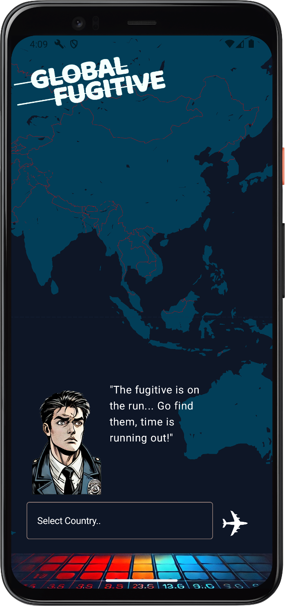

# GlobalFugitive

_Initial Build: Aug 2024_

An Android geography guessing game built with Kotlin and Jetpack Compose. A fugitive is hiding somewhere in the world — you have 5 guesses to track him down.



## Gameplay

- A random mystery country is selected at the start of each game
- Type or search for a country to make a guess
- Wrong guesses show the distance in km from your guess to the mystery country
- Your guesses are pinned on an interactive Google Maps view
- An "authority" character reacts to how close your guesses are
- Find the country within 5 guesses to catch the fugitive — or they escape!

## Features

- **Geography guessing game** with 5 guesses per round
- **Distance feedback** using the Haversine formula to calculate km between guesses and the mystery country
- **Interactive Google Maps** showing all guesses as markers
- **Google Places autocomplete** for country search input
- **Live weather widget** on the main menu showing current weather for a random city (via weather API)
- **Firebase Authentication** — email/password sign-in and Google Sign-In
- **User profiles** stored in Firestore with editable display name, date of birth, and gender
- **Navigation drawer** for moving between screens
- **Win/loss screen** revealing the mystery country and its flag emoji

## Tech Stack

| Layer          | Technology                                |
| -------------- | ----------------------------------------- |
| Language       | Kotlin                                    |
| UI             | Jetpack Compose + Material 3              |
| Architecture   | MVVM (ViewModels + LiveData)              |
| Navigation     | Jetpack Navigation Compose                |
| Maps           | Google Maps SDK for Android, Maps Compose |
| Search         | Google Places API                         |
| Local database | Room                                      |
| Backend        | Firebase Auth, Cloud Firestore            |
| Networking     | Retrofit + Gson                           |
| Image loading  | Coil                                      |

## Project Structure

```
app/src/main/java/com/example/globalfugitive/
├── MainActivity.kt          # App entry point, initialises Firebase, Places API, ViewModels
├── AppNavigation.kt         # Top-level nav graph
├── Landing.kt               # Splash/landing screen
├── MainMenu.kt              # Main menu with weather widget
├── GamePlayScreen.kt        # Core game UI (map, search, guess list)
├── GameViewModel.kt         # Game logic: guessing, distance, win/loss
├── GameViewModelFactory.kt
├── EndGame.kt               # Win/loss result screen
├── Country.kt               # Country data model
├── CountryDAO.kt            # Room DAO for country queries
├── CountryDatabase.kt       # Room database definition
├── CountryDatabaseCallback.kt
├── CountryViewModel.kt
├── CityData.kt              # City data for weather widget
├── GetRandomCity.kt
├── DrawerNavigation.kt      # Navigation drawer setup
├── DrawerContent.kt
├── DrawerMenu.kt
├── SignInScreen.kt          # Email/password + Google sign-in
├── SignUpScreen.kt
├── GoogleSignInButton.kt
├── User.kt                  # User data model
├── UserViewModel.kt         # Auth and Firestore user management
├── UserProfile.kt           # Profile screen (edit name, DOB, gender)
├── Maps.kt                  # Google Maps composable with guess markers
├── CountryPredictions.kt    # Places API autocomplete helpers
├── RetrofitInterface.kt     # Weather API interface
├── RetrofitObject.kt        # Retrofit client
├── RetrofitViewModel.kt
└── WeatherData.kt / WeatherRepository.kt
```

## Setup

### Prerequisites

- Android Studio (Hedgehog or later recommended)
- Android SDK 24+
- A Firebase project
- A Google Cloud project with the following APIs enabled:
  - Maps SDK for Android
  - Places API
- A [WeatherAPI](https://www.weatherapi.com/) account for the weather widget

### API Keys

Create a `secrets.properties` file in the project root (this file is not checked into version control):

```properties
# Google Maps SDK for Android
MAPS_API_KEY=your_google_maps_api_key

# Google OAuth 2.0 Client IDs (from Google Cloud Console > APIs & Services > Credentials)
WEB_CLIENT_ID=your_web_client_id.apps.googleusercontent.com
APP_CLIENT_ID=your_android_client_id.apps.googleusercontent.com

# Weather API (https://www.weatherapi.com/)
WEATHER_API_KEY=your_weather_api_key
```

> **Note:** For `MAPS_API_KEY`, add an Android restriction in Google Cloud Console using your app's package name (`com.example.globalfugitive`) and SHA-1 certificate fingerprint. Run `./gradlew signingReport` to get your debug SHA-1.

### Firebase

1. Create a Firebase project at [firebase.google.com](https://firebase.google.com)
2. Add an Android app with package name `com.example.globalfugitive`
3. Download `google-services.json` and place it in the `app/` directory
4. Enable **Authentication** (Email/Password and Google providers)
5. Enable **Cloud Firestore**

### Build

```bash
./gradlew assembleDebug
```

Or open the project in Android Studio and run on an emulator or device (API 24+).

## Requirements

- **Target SDK:** 36
- **Compile SDK:** 36
